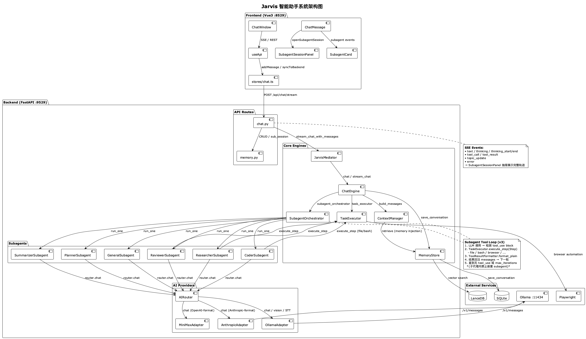

# Jarvis（贾维斯）智能助手系统



## 系统概述

Jarvis 是基于 FastAPI + Vue 3 的智能助手系统，支持完整的多模态交互、子代理委派、工具执行和长程记忆。

**技术栈**

| 层级 | 技术 |
|------|------|
| 前端 | Vue 3 + Vite + Pinia + Tailwind CSS（端口 8529）|
| 后端 | FastAPI + uvicorn（端口 9529）|
| AI | Ollama（本地）/ Anthropic / OpenAI / MiniMax（ProviderInstance 可配置）|
| 记忆 | SQLite + LanceDB（向量检索）|
| 工具执行 | TaskExecutor（Strategy Pattern）|
| 子代理 | SubagentOrchestrator（独立会话 + 工具循环）|

## 快速开始

```bash
./jarvis.sh start   # 启动后端 + 前端
./jarvis.sh stop    # 停止所有服务
./jarvis.sh status  # 查看运行状态
```

## 核心能力

| 能力 | 说明 | 触发方式 |
|------|------|----------|
| **听** | 语音识别（Whisper STT）| 麦克风按钮 |
| **说** | 语音合成（浏览器 SpeechSynthesis）| 说"speak" |
| **读** | 文件/图片/PDF 读取 | 粘贴图片、文件上传 |
| **写** | 代码/文档生成、文件操作 | 直接对话 |
| **执行** | 工具调用（文件/Bash/浏览器/子代理...）| 对话中自然触发 |

## 子代理（Subagent）

主对话可将任务委派给隔离的子代理，每个子代理拥有独立会话：

| 角色 | 说明 |
|------|------|
| **Researcher** | 网络调研、多源信息收集 |
| **Coder** | 代码生成、执行、文件写入（带工具循环）|
| **Reviewer** | 代码/方案评审（优/问/建三段式）|
| **Summarizer** | 长文本摘要、结构化要点提取 |
| **Planner** | 任务拆解与验收标准 |
| **General** | 通用隔离子代理 |

主 LLM 通过 `subagent` 工具委派任务，支持串行（sequential）、并行（parallel）、map_reduce 三种编排模式。

## 工具系统

### 内置工具（TaskExecutor Strategy）

| 工具 | 说明 |
|------|------|
| `file` | 读写/编辑/列表/创建文件，带路径穿越保护 |
| `bash` | Shell 命令执行，含危险命令黑名单 |
| `browser` | Playwright 浏览器自动化 |
| `desktop` | pyautogui 桌面控制 |
| `api` | 外部 HTTP API 调用 |

### 技能（Skills）

通过 `Skill` 工具调用，技能定义在 `workspace/skills/` 目录，支持 markdown 编写 + YAML frontmatter 元数据。

## 记忆系统

- **上下文压缩**：`ContextManager` 按 token 预算动态裁剪历史，注入相关记忆（top-k 向量检索）。
- **会话持久化**：对话保存到 SQLite，LanceDB 支持语义搜索。
- **独立子会话**：每个 subagent 调用创建独立 Conversation，父会话可跳转查看完整执行轨迹。

## 开发

```bash
# 后端（热重载）
uvicorn jarvis.main:app --reload --port 9529

# 前端（热重载）
cd frontend && npm run dev -- --port 8529

# 运行测试
python -m pytest tests/ -v
```

## 文档

- `CLAUDE.md` — 架构设计、技术细节、开发命令
- `DEVELOPMENT_PLAN.md` — 架构文档与功能路线图
- `DESIGN_PATTERNS.md` — 设计模式详解
- `bugs.md` — Bug 记录与解决方案
- `TODO.md` — 功能优先级

---

*Jarvis 系统，随时待命。*
